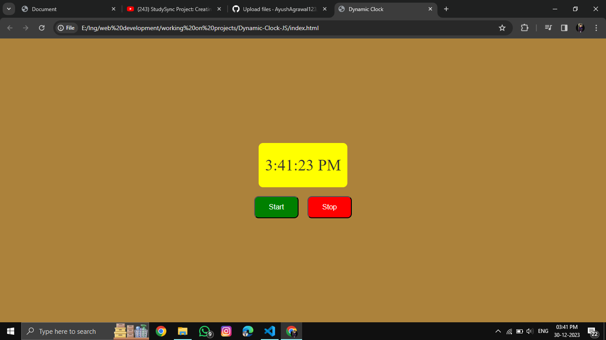

# Dynamic Color Changer Website with Digital Watch

## Overview

Welcome to the Dynamic Color Changer website with a built-in digital watch! This project provides a visually engaging experience by dynamically changing the background color every second, creating a vibrant and dynamic atmosphere. The website also features a digital watch that updates in real-time, displaying the current time.

## How to Use

1. **Visit the Website:**
   - Simply open your web browser and navigate to the provided
   -  [Dynamic Color Changer]
     https://ayushagrawal123.github.io/Web_Development/Dynamic-Clock-JS/

2. **Explore the Color Changes:**
   - Observe the continuous and smooth transition between different background colors every second.

3. **Toggle Digital Watch:**
   - Use the provided toggle button to turn the digital watch on or off, according to your preference.

4. **Pause/Resume Color Changes:**
   - Pause and resume the dynamic color changes using the designated control, allowing you to freeze the background color at any moment.

## Technologies Used

- HTML5
- CSS3
- JavaScript

## Screenshot

## Credits

This project was created as a demonstration of dynamic web design using HTML, CSS, and JavaScript. Feel free to explore the code and customize it to suit your preferences. If you have any feedback or suggestions, please don't hesitate to reach out.

Happy exploring! 🌈⌚️
