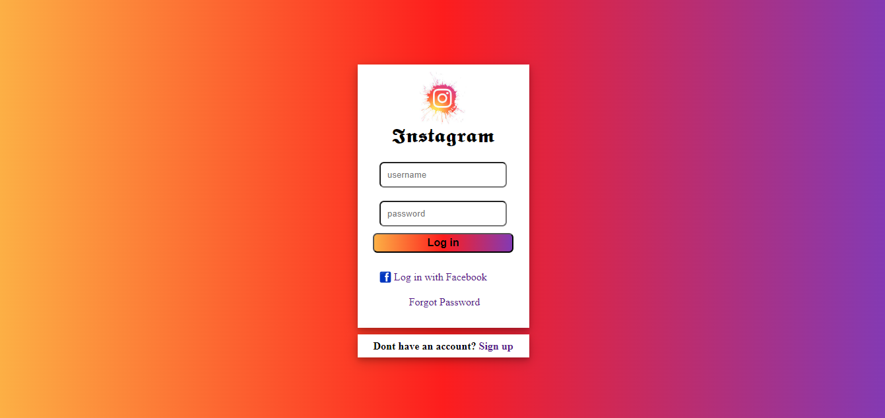

# Instagram Login Page Replica

## Overview

Welcome to the Instagram Login Page Replica project! This project aims to recreate the Instagram login page for educational purposes, showcasing HTML and CSS skills.

## How to Use

1. **Visit the Replica:**
   - Open your web browser and navigate to the provided Instagram Login Replica
   https://ayushagrawal123.github.io/Web_Development/Instagram-Login-Page/

2. **Explore the Login Page:**
   - Familiarize yourself with the login form, resembling the official Instagram login page.

3. **Input Credentials:**
   - Enter a username and password (Note: This is a replica for educational purposes and does not interact with Instagram servers).

## Technologies Used

- HTML5
- CSS3

## Screenshot

## Credits

This project was created as a practice exercise to replicate the Instagram login page using HTML and CSS. Feel free to explore the code and customize it as needed. If you have any feedback or suggestions, please don't hesitate to reach out.

Happy coding! 📸🔒
