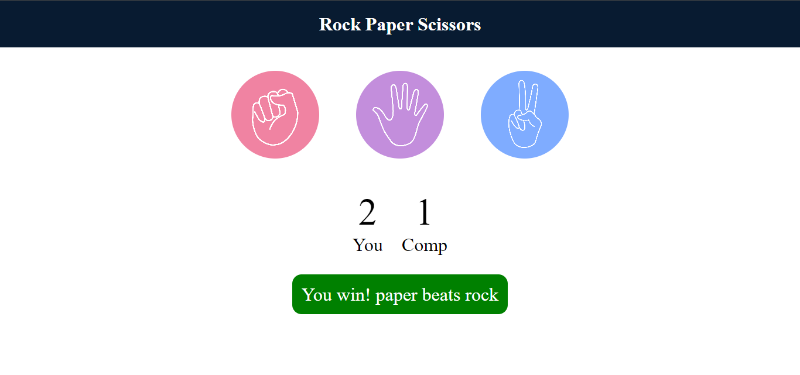

# Rock Paper Scissors Game

Welcome to the Rock Paper Scissors game! This project is a simple web-based implementation of the classic Rock Paper Scissors game.

## Demo

Check out the live demo [here](https://ayushagrawal123.github.io/Web_Development/Rock-Paper-Scissor-Apna-College/).

## Features

- Play Rock Paper Scissors against the computer.
- Keep track of your score.
- Responsive design for various screen sizes.

## Technologies Used

- HTML
- CSS
- JavaScript

## Usage

1. Open the [demo link](https://ayushagrawal123.github.io/Web_Development/Rock-Paper-Scissor-Apna-College/) in your web browser.
2. Click on your preferred move (Rock, Paper, or Scissors).
3. See the result and the updated scores.

## Screenshots

## How to Contribute

If you would like to contribute to this project, feel free to fork the repository and submit a pull request.

Happy gaming!
