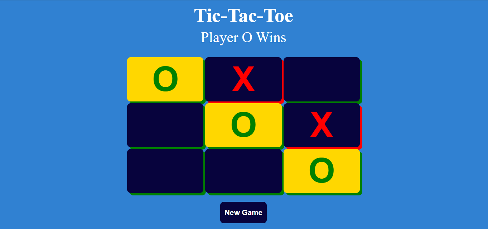

# Tic Tac Toe Game

## Overview

This project is a simple implementation of the classic Tic Tac Toe game. The game is designed for two players who take turns marking spaces on a 3x3 grid. The objective is to form a horizontal, vertical, or diagonal line of their respective symbols (X or O) before the opponent.

## Features

- **Interactive Gameplay:** Two players can take turns to make their moves on the game board.
- **Winning Conditions:** The game checks for winning conditions after each move and declares a winner when a player forms a line.
- **Draw Detection:** In case the board is filled and no player has won, the game is declared a draw.
- **Responsive Design:** The game interface is designed to be responsive and works well on various screen sizes.
- **New Game Option:** Players can start a new game at any time, resetting the board.

## Technologies Used

- HTML, CSS, JavaScript

## How to Play

1. Clone the repository to your local machine.
2. Open the `index.html` file in your web browser.
3. Take turns with another player to make moves on the board.
4. The game will automatically detect a win or draw and display the result.
5. To start a new game, click on the "New Game" button.

Feel free to explore and enjoy a round of Tic Tac Toe!

## Screenshots

## Contributing

If you find any issues or have suggestions for improvement, please open an issue or create a pull request.

Happy gaming!
